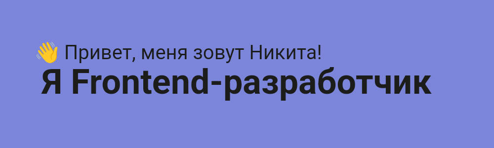

https://img.shields.io/badge/Telegram-403a3a?logo=telegram&link=https%3A%2F%2Ft.me%2FNikitaSech

https://img.shields.io/badge/NikitaSech%40yandex.ru-403a3a?cacheSeconds=mailto%3Anikitasech%40yandex.ru

Изучаю сферу разработки около 5 лет и имею достаточно устоявшиеся и структурированные знания. В 2020 году успешно отучился в HTML Academy по профессии «Фронтенд-разработчик».

Исваиваю и использую современные технологии и лучшие практики разработки.

⚡ В свободное время веду активный образ жизни: занимаюсь верховой ездой и прыжками с парашютом.

<h3 align="center">🤖 Навыки и умения</h3>

🧠 Сейчас изучаю паттерны проектирования, архитектуру веб-приложений, алгоритмы и структуры данных.

- 🖥️ [Резюме в Notion](http://nikitasech.notion.site/2541b10299cb4873a84aaaab97b13116?pvs=4)
- ✈️ [Telegram: @NikitaSech](http://t.me/NikitaSech)
- ✉️ [NikitaSech@yandex.ru](mailto:nikitasech@yandex.ru)

✨ Мечтаю сделать этот мир лучше ✨

